# Taste of Africa

## Introduction

Taste of Africa is a restaurant website designed based to display the user their menu & enable the user to make/ammend/edit their reservations. This project is stritcly for educational purposes.

# UX

## User Stories

 1. As a user, I am able to navigate through the website and view desired content with minimal issue
 2. As User, I want to be able to obtain key information of the restaurant from the landing page
 3. As the admin, I am able to login to the admin page so I can access the site's back end
 4. As the site admin, I can display the restaurant menu options so that the user knows what is on offer
 5. As a user, I want to be able to fill a booking form in order to make a reservation
 6. As a user, I want to be able to register in order to log in and access my bookings
 7. As a user, I want to be able to make amendments to my booking when I need/want to
 8. As a user, I want to be able to log in and cancel my booking when necessary
 9. As a user, I want to be aware of the opening time for when I want to make a reservations
 10. As a user, I want to be able to log in and see all my reservations
 11. As the site owner, I want to be able to access the admin panel and be able to update the menu list.

 # Structure 

 ## Wireframes

 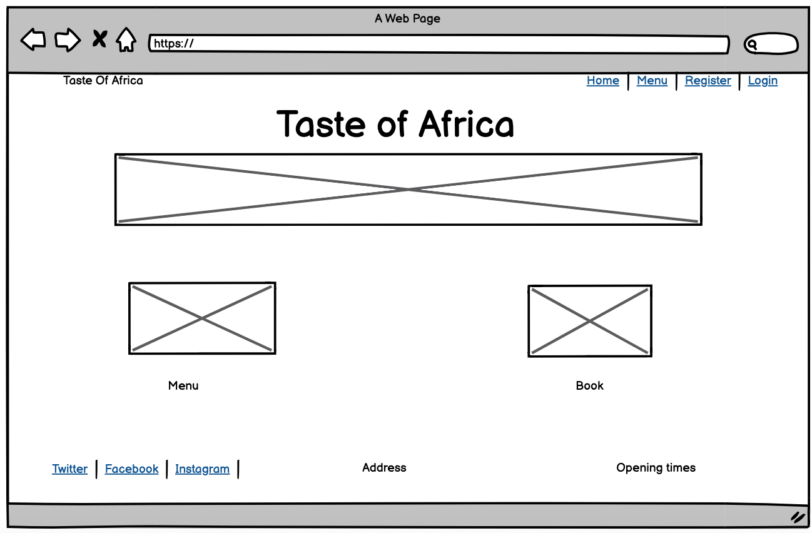
 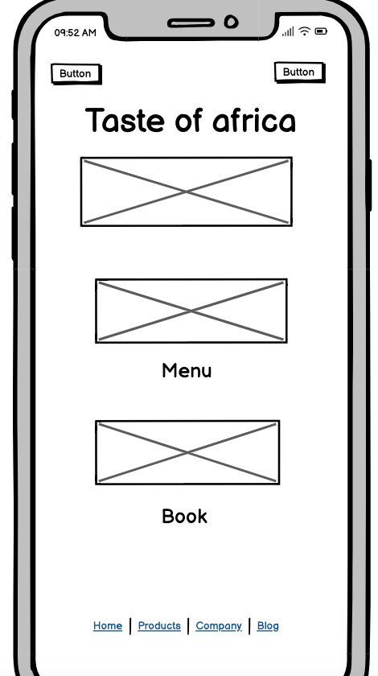
 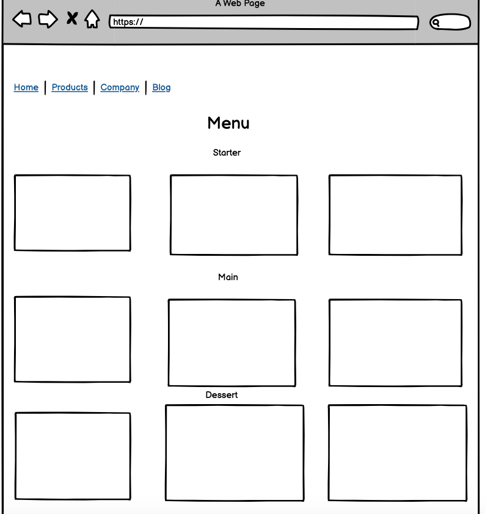
 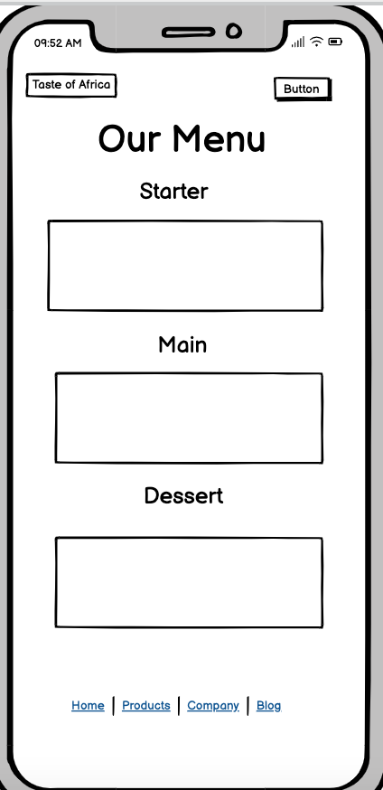
 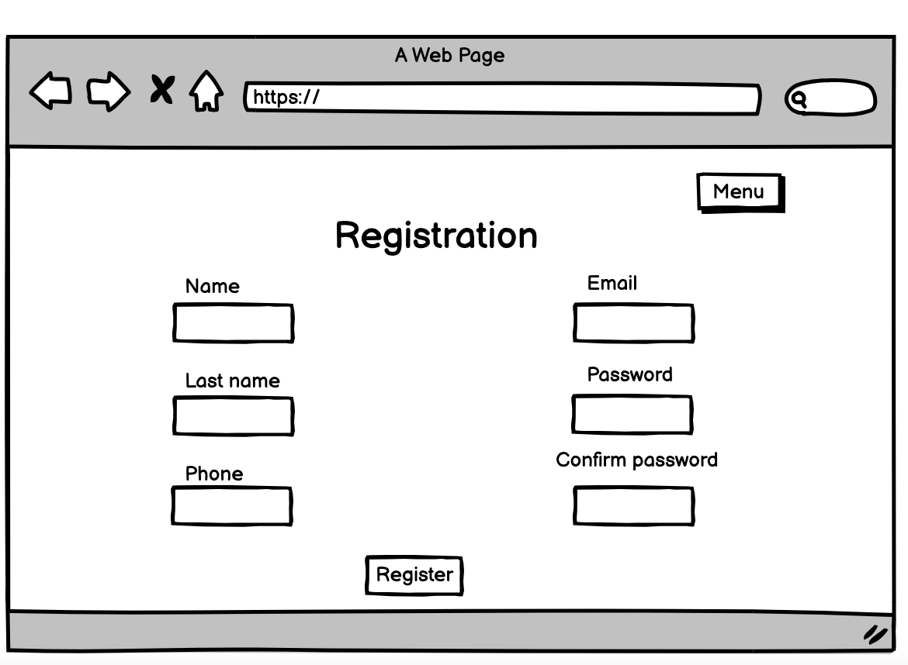
 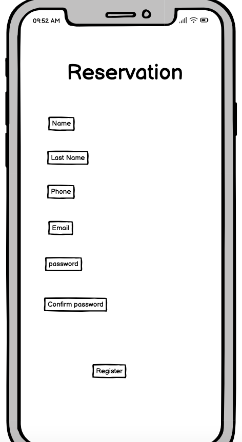
 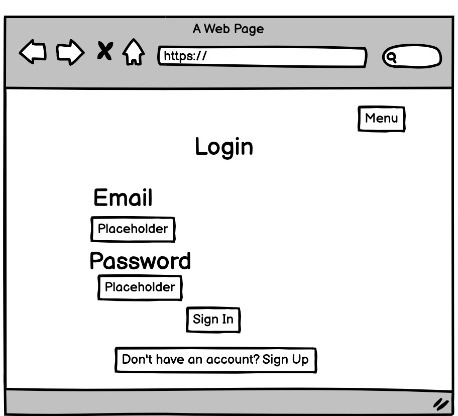
 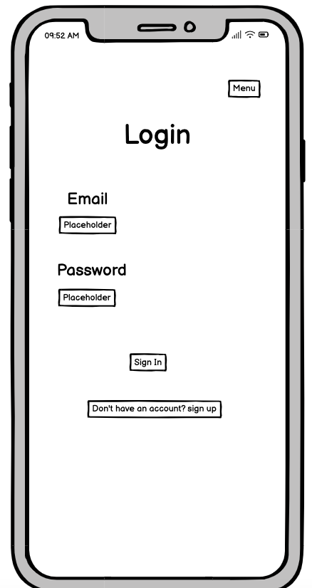
 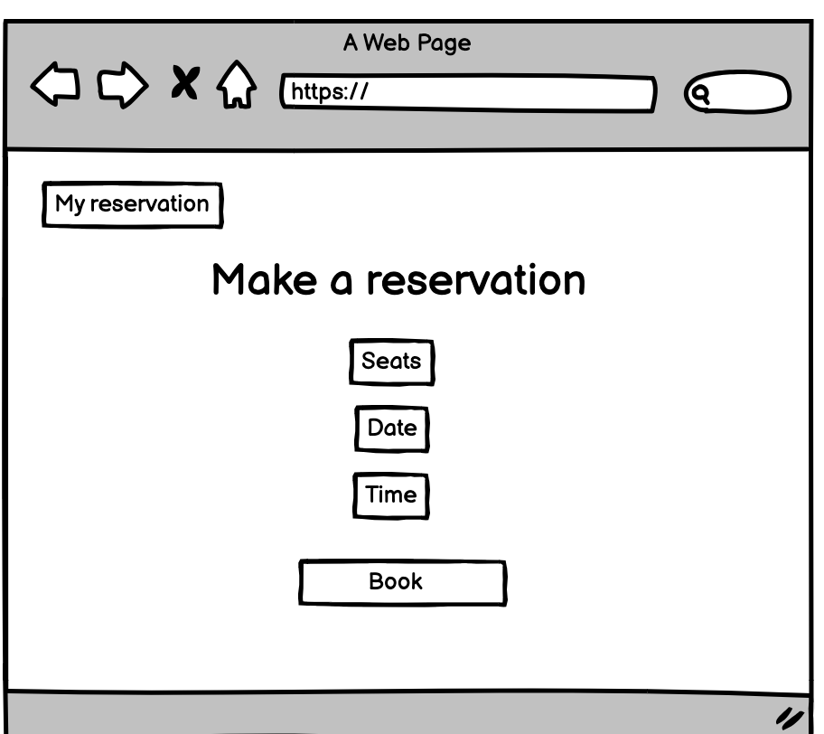
 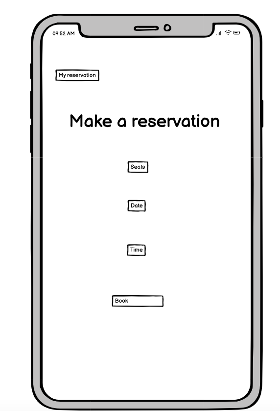

 #  Features

 ## Color Theme

 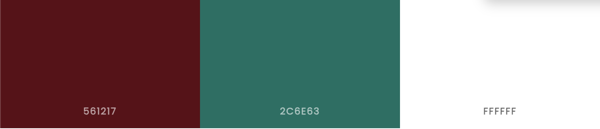

 On the homepage, the navigation has all the links to the active pages for the user which are clearly labelled. The user has the ability to have a look at the menu via the navigation bar. The user can also have a look at the menu by clicking on the card underneath the carousel. The same can also be done by clicking "Book", if the user decided to make a reservation.

 if the user is authenticated, the dropdown will appear under "My account" where my reservation and logout will appear. From there the user can manage their reservations(either delete or ammend)

 ## Carousel Images 

 
 
 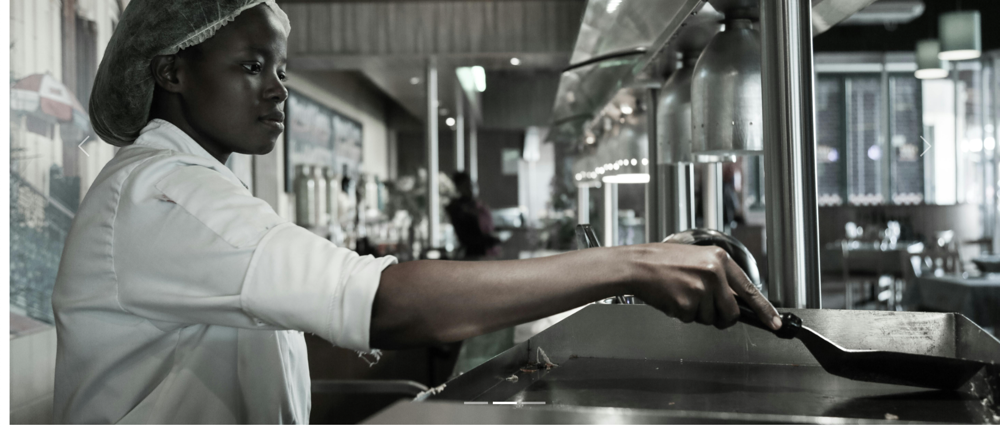

## Technologies Used 

In order to make my project work, I have used several technologies along the way 

- [Font Awesome](https://fontawesome.com/)
  - Font awesome used for the social account on the footer 

- [wireframes](https://balsamiq.cloud/sgufrs/pumdhj9/r0813)
  - for the wireframes content of the site 

- [Gitpod](https://www.gitpod.io/)

- [GitHub](https://github.com/)

- [Scheme Colors](https://www.schemecolor.com/)
  - for the color theme used on the site 

- [Heroku](https://heroku.com/)

- [Django](https://www.djangoproject.com/)
  - The framework that was used to build the overall project 

- [Cloudinary](https://cloudinary.com/)
  - To store images used on the project

# Credits

throughout the whole process of building this website, I have used a number of different sources that have helped me solve a number of issues/bugs that I have come across along the way. Furthermore, I have taken some inspirations on building the websites functionality and looks from the sources below

- The carousel element can be found from the following links below 
  - [Bootstrap](https://getbootstrap.com/docs/5.3/components/carousel/)

- the Nav bar 
  - [Navbar](https://getbootstrap.com/docs/5.3/components/navbar/)

- The idea behind how the menu app was designed was inspired from the below 
  - [Card](https://getbootstrap.com/docs/5.3/components/card/)

- Unsplash & pexels for the images used across the site 
  - [Pexels](https://www.pexels.com/)
  - [Unsplash](https://unsplash.com/)

- Query set to filter through the reservation view 
  - (https://docs.djangoproject.com/en/5.1/topics/class-based-views/generic-display/#viewing-subsets-of-objects)

- Reservation model was inspired by the link below 
  - (https://blog.devgenius.io/django-tutorial-on-how-to-create-a-booking-system-for-a-health-clinic-9b1920fc2b78)

- For my reservation model, form & views, I used the below stackoverflow links to help overcome any issues 
  - (https://stackoverflow.com/questions/61076688/django-form-dateinput-with-widget-in-update-loosing-the-initial-value)
  - (https://stackoverflow.com/questions/849142/how-to-limit-the-maximum-value-of-a-numeric-field-in-a-django-model)
  - (https://stackoverflow.com/questions/50439356/django-date-validation-help-needed)
  - (https://stackoverflow.com/questions/48872380/display-multiple-queryset-in-list-view)

- The crispy form template was downaloded with the help of the link below 
  - (https://stackoverflow.com/questions/75706202/attributeerror-settings-object-has-no-attribute-crispy-template-pack)

