# Taste of Africa

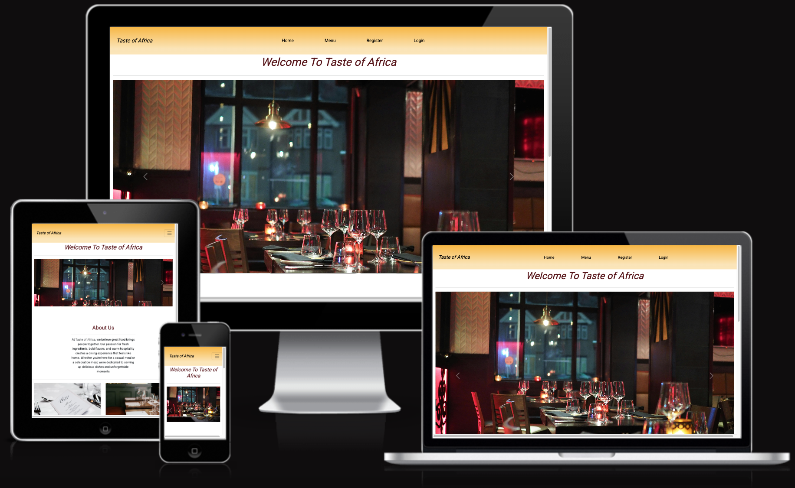

[Link to the live website](https://taste-of-africa-e622c7aa7e3a.herokuapp.com/)

## Introduction

Taste of Africa is a restaurant website designed based to display the user their menu & enable the user to make/ammend/edit their reservations. This project is stritcly for educational purposes. With the use of Bootstrap and Django Framework, it gives users the functionality to register and account and reserve a table in advance. It includes full CRUD functionality on reservations.

# Agile Methodology

The plan for this project was carried out using Agile Methodology. The Github issues which can be viewed here:
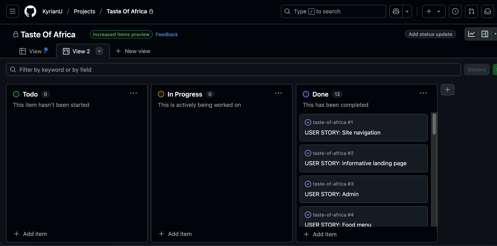
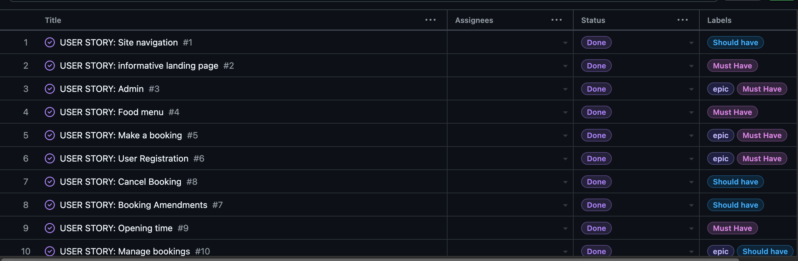
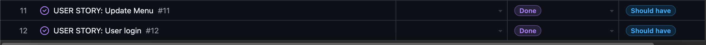

Every User story contains Acceptance Criteria and Tasks, some of these had to be amended as I was not too sure what needed to be done to achieve the Acceptance criteria.

The MOSCOW METHOD OF PRIORITISATION was also used, classfifying each User Story as either 'Must Have', 'Should Have', or 'Could Have'. 

Overall, the use of Agile methodology was of great benefits as it helped with organising the development of the project. Even though there was not timeframe set for each User Story, it helped with my time management.

# User Experience (UX)

## Site Goals

Taste of Africa is a restaurant that aims to satisfy new and existing customers by maintaining an update and user friendly website with simple online menu, a reservation system and contact information with opening times. There's a short story about what the restaurant is also about.

## User Stories

 1. As a user, I am able to navigate through the website and view desired content with minimal issue
 2. As User, I want to be able to obtain key information of the restaurant from the landing page
 3. As the admin, I am able to login to the admin page so I can access the site's back end
 4. As the site admin, I can display the restaurant menu options so that the user knows what is on offer
 5. As a user, I want to be able to fill a booking form in order to make a reservation
 6. As a user, I want to be able to register in order to log in and access my bookings
 7. As a user, I want to be able to make amendments to my booking when I need/want to
 8. As a user, I want to be able to log in and cancel my booking when necessary
 9. As a user, I want to be aware of the opening time for when I want to make a reservations
 10. As a user, I want to be able to log in and see all my reservations
 11. As the site owner, I want to be able to access the admin panel and be able to update the menu list.

 # Structure 

 ## Wireframes

 Please note that the actual website may differ slightly from the original wireframes screeenshots. I used Balsamiq for the wireframes to give a closer indication of the design. 

 
 
 
 
 
 
 
 
 
 

 ## Database

 

 # Features

 ## Color Theme

 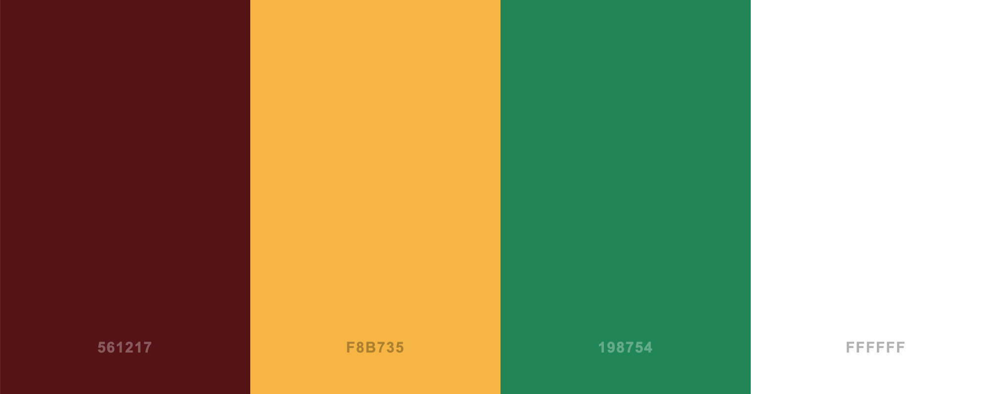

 On the homepage, the navigation has all the links to the active pages for the user which are clearly labelled. The user has the ability to have a look at the menu via the navigation bar. The user can also have a look at the menu by clicking on the card underneath the carousel. The same can also be done by clicking "Book", if the user decided to make a reservation.

 if the user is authenticated, the dropdown will appear under "My account" where my reservation and logout will appear. From there the user can manage their reservations(either delete or ammend)

 ## Carousel Images 

 
 
 

 ## Menu 

 The menu page is reachable via the Menu Link on the nav bar or by the responsive menu link just above the footer. It includes:

  * Well categorised menu, clear divide betweent the Starter, Main and Dessert menu. Makes for a more enhanced customer experience
  * The background and text are well styled for an enhanced visual experience

 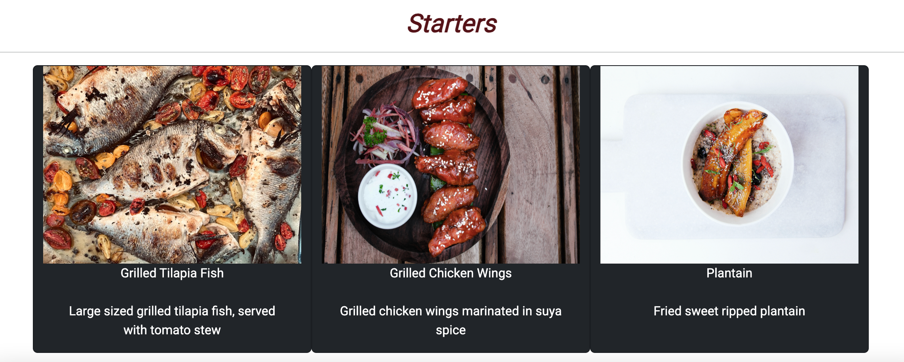
 
 

 ## Footer

 Featured on all pages, the footer is essential for the user/customer as it encourages them to get In touch with the restaurant either by email or telephone. Alternatively, they could also keep connected via social media with the links provided. The footer includes:

  * All social media links have a pointer cursor
  * Social media links open in an another tab so that users are not directed away from the website
  * The business address, phone number and email address are dipayed on the footer
  * The opening time are also displayed on the footer

 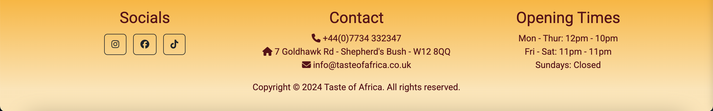

 ## Navbar 

 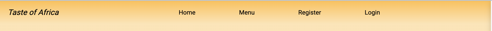
  - the navbar when the user has not logged in/registered

 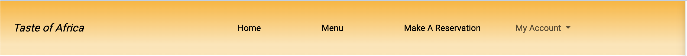
  - The navbar when the user has logged in/registered

## Login

A registered user is able to access the login page either via the navigation bar or via the book button button just above the footer. The Login page is simple enough for the users to follow and login to make a reservation but also has a clear message for those who have not yet signed up.

The login page is styled in a constent manner with the rest of the website. The form is then submitted via the sign in bottom at the bottom of the form. 

When the user clicks Sign in, they are then redirected to the home page.

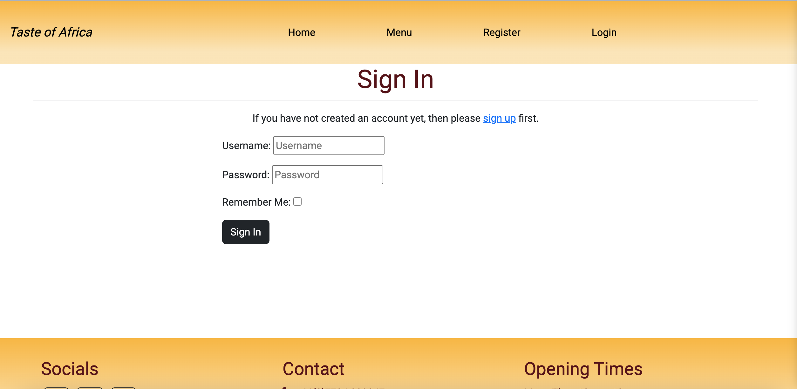

## Logout

The website gives a registered used the functionality to logout of the website

  * The logout page can only be accessed from the navigation bar and only when the user is logged in 
  * The user will receive a confirmation that they would like to log out 
  * The sign out button logs the user out directs back to the homepage 

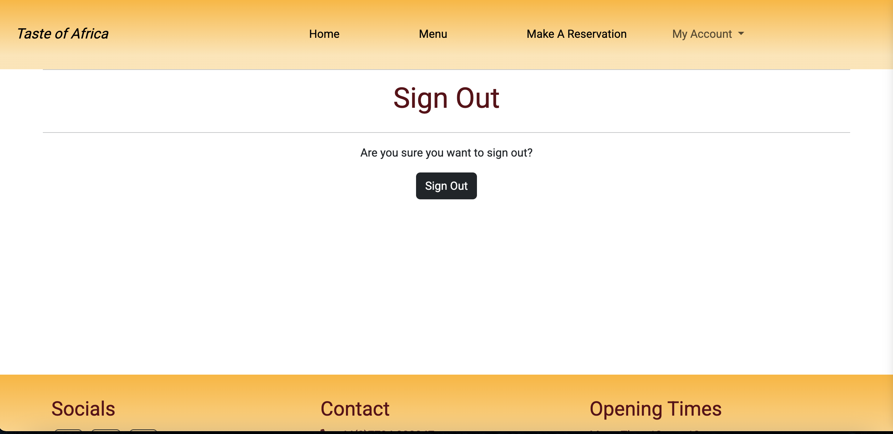

## Sign UP

The website has the functionality for a user to register for an account.

 * The registration form can be accessed through the nav bar or when the user click on the sign up link on the login page

 * At the top of the sign up page, there is a link to login page if the user already has an account with us.

 * It uses django-allauth to provide all the settings for user authentication and includes the fields below. 

   * Username (unique)
   * Email (optional)
   * Password
   * Password repeat

The form is submitted via the Signup button at the bottom of the form. When the user click on the SignUp button they are redirected to the home page. On the navbar, you will see logout replacing login and sign up links

## Request Reservation

The website give functionality to the user to book/reserve a table via the make a reservation link.

- The user must be logged in/signed up to access the make a reservation link and booking a table
- A user cannot make a reservation without filling the form correctly
- The user is requsted to input a name in the name field, if the user tries to book a table without a name in the name field, it will prompt the form to throw an error message
- The seat feild only accepts numbers greater tha 0, negative numbers will not be accepted
- The date field only accepts current and future dates
- The date field will not allow users to book a reservation on a sunday as it's the only day in which it is closed.
- The TimeField is a dropdown with the list of time slots available as per the restaurants opening time of the restaurants.
- If the information passes the validation, the submit button directs the user back to the manage reservation page, where the user can view their existing bookings.
- Each bookings will have the corresponding edit/cancel reservation button for the user to manipulate their bookings.

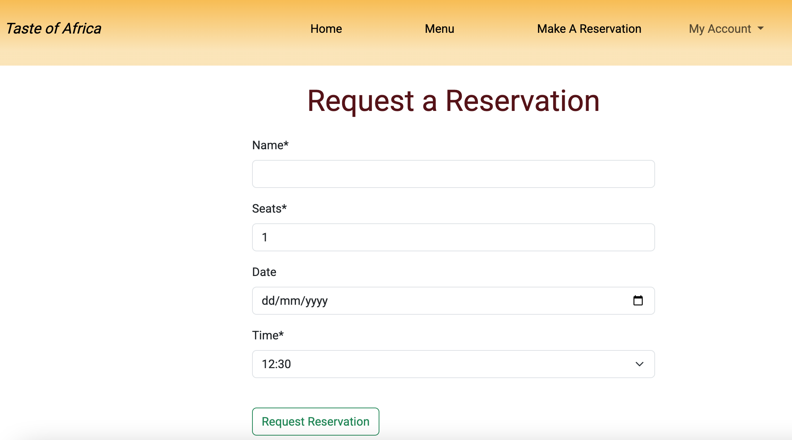

## My reservation

The site gives the user the functionality to keep track of their bookings via the manage reservation link. The user can only access this page once they're logged in, or once they've made a reservation.

 - When the user goes on the manage reservation link, they will only see bookings made from this particular user will be displayed 
 - Each reservation will include the following:
     * The name
     * Number of guest
     * Date of the reservation
     * Time of reservation
     * Booking ID
     * Edit/Cancel button at the bottom of the booking

-  The information on the reservation page can change subject to the customer chooisng to either update the booking or cancelling the booking entirely.

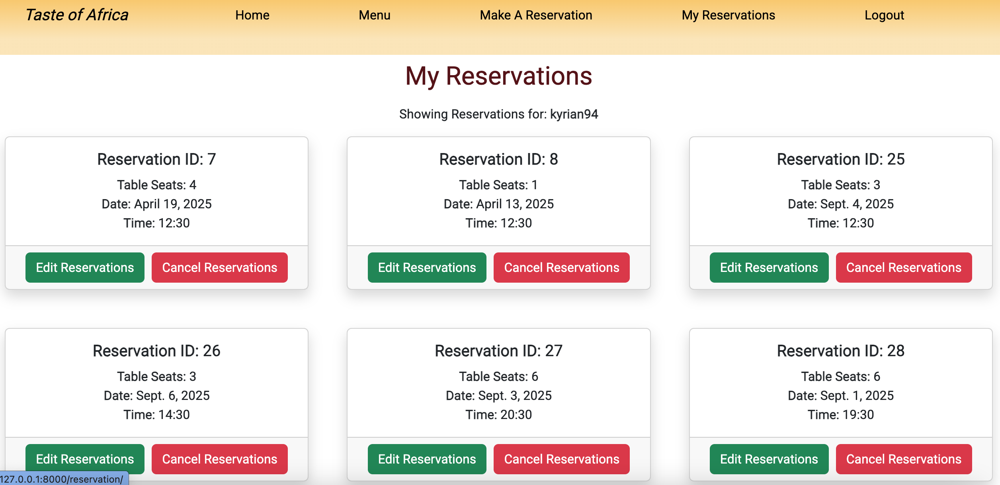 

## Admin Panel 

The site offers the restaurant owner the ability to view and interact with the database in the Django admin panel.

  * You can access the admin panel by simply typing /admin/ at the end of the URL in the URL bar
  * This will then bring the user to the Django Admin Panel Login Page, where the user will be     prompted to input their Username and Password. Only the superuser has permission to login.
  * The Superuser has the permission to add, amend and delete and view everything.
  

### Features to implement in the future

- Introduce vegan or vegetarian menu
- Information about allergies
- Food prices
- Drinks menu
- Forgot/Reset password functionality
- Customer review section, customers can leave review on meals they've had, which could help with improvements
- A small map of where the restaurant is.

## Technologies Used 

In order to make my project work, I have used several technologies along the way 

- [Font Awesome](https://fontawesome.com/)
  - Font awesome used for the social account on the footer 

- [wireframes](https://balsamiq.cloud/sgufrs/pumdhj9/r0813)
  - for the wireframes content of the site 

- [Gitpod](https://www.gitpod.io/)

- [GitHub](https://github.com/)

- [Scheme Colors](https://www.schemecolor.com/)
  - for the color theme used on the site 

- [Heroku](https://heroku.com/)

- [Django](https://www.djangoproject.com/)
  - The framework that was used to build the overall project 

- [Cloudinary](https://cloudinary.com/)
  - To store images used on the project

For testing write up please refer to [TESTING.MD](TESTING.md)

## Deployment 

### Heroku

The website was deployed using [Heroku](https://id.heroku.com/login)

the steps for the deployment are listed below:

- Login/SignUp to Heroku
- Once signed in, from the dashboard click "New" then click "Create New App"
- You will have to enter a unique name for your projects. Once chose, select the region
then press "Create New App"
- Set up your Environment variables - a very vital step to ensure your application is deployed
properly
- Go to "Reveal config vars" and set the following:
  - SECRET_KEY - to be set to your chosen key
  - CLOUDINARY_URL - To bet set to your Cloudinary api 
- Heroku Postgres must be installed 

In the deploy tab 

- Click on the deploy tab and then choose "Github-Connect to Github"
- Enter the Github repository then click search 
- choose the appropriate repository for your application. Once done, click on "Connect"
- You will then have two options(automatic or manual deployment), the automatic deployment will generate a new application everytime a change has been pushed to github, whereas the manual deployment requires the user to "Deploy Branch" button whenever the user wants to make a change.
- Once the method of deployemnt has been selected, click on "Deploy Branch", your application should then be built. To then see it, click view

#### Final Deployment

1. When the development is complete, if you had left `Debug = True` in settings.py file, it is very important to change to `Debug = False`
2. Commit and push your codes to your project repository
3. Once that is done, open up Heroku, navigate to your project's app. Click on the settings tab, open up the config vars and delete the DISABLE_COLLECTSTATIC variable.
4. Navigate to 'Deploy' tab and scroll all the way down to 'Deploy a Github Branch'
5. Please select the branch you want to deploy and then click on the Deploy Branch button. When the app has been deployed, you should be able to see a successfull message in the built log saying 'Your app was successfully deployed'. To view the app on the browser, click 'View', or you can you click on 'Open App' button at the top of the page.

# Credits

throughout the whole process of building this website, I have used a number of different sources that have helped me solve a number of issues/bugs that I have come across along the way. Furthermore, I have taken some inspirations on building the websites functionality and looks from the sources below

- The carousel element can be found from the following links below 
  - [Bootstrap](https://getbootstrap.com/docs/5.3/components/carousel/)

- the Nav bar 
  - [Navbar](https://getbootstrap.com/docs/5.3/components/navbar/)

- The idea behind how the menu app was designed was inspired from the below 
  - [Card](https://getbootstrap.com/docs/5.3/components/card/)

- Unsplash & pexels for the images used across the site 
  - [Pexels](https://www.pexels.com/)
  - [Unsplash](https://unsplash.com/)
  - [Pixabay](https://pixabay.com/)

- Query set to filter through the reservation view 
  - [Django Project](https://docs.djangoproject.com/en/5.1/topics/class-based-views/generic-display/#viewing-subsets-of-objects)

- Reservation model was inspired by the link below 
  - [Django Tutorials](https://blog.devgenius.io/django-tutorial-on-how-to-create-a-booking-system-for-a-health-clinic-9b1920fc2b78)

- For my reservation model, form & views, I used the below stackoverflow links to help overcome any issues 
  - [Stackverflow](https://stackoverflow.com/questions/61076688/django-form-dateinput-with-widget-in-update-loosing-the-initial-value)
  - [Stackoverflow](https://stackoverflow.com/questions/849142/how-to-limit-the-maximum-value-of-a-numeric-field-in-a-django-model)
  - [Stackoverflow](https://stackoverflow.com/questions/50439356/django-date-validation-help-needed)
  - [Stackoverflow](https://stackoverflow.com/questions/48872380/display-multiple-queryset-in-list-view)

- The crispy form template was downaloded with the help of the link below 
  - [Stackoverflow](https://stackoverflow.com/questions/75706202/attributeerror-settings-object-has-no-attribute-crispy-template-pack)

