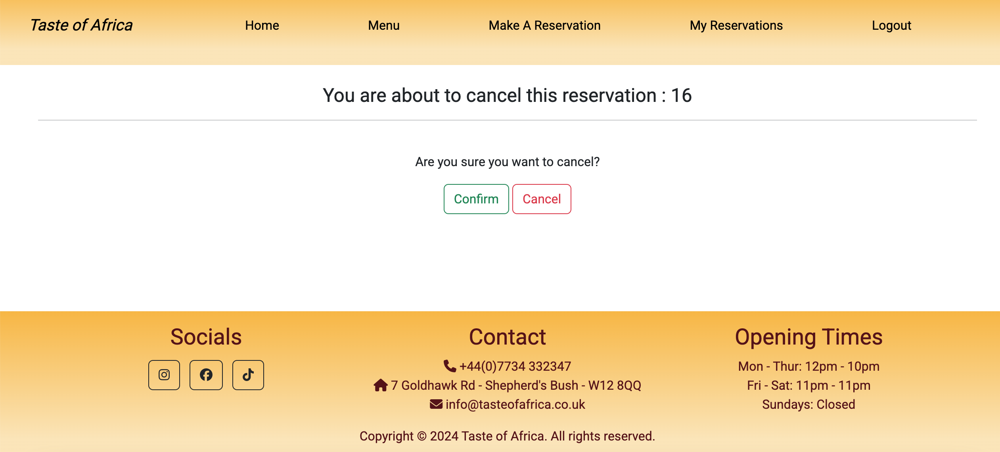

# Testing 

Please click the link ahead to return to readme file [README](README.md)

## User stories 

### As a user, I am able to nagivate through the website and view desired content with minimal issues

 - As a user, I am able to navigate through the website and view desired content with minimal issues. Each feature has a navigation links which works perfectly, and these links can be found on the homepage

 ### As User, I want to be able to obtain key information of the restaurant from the landing page

  - As a user, I am able to obtain key informatiion of the restaurant from the landing page. The opening times are clearly displayed at the bottom of the page, on the footer. The social media links and address are also clearly displayed on the footer. It also clearly states how to book a reservation and also how to access the menu page.

### As the admin, I am able to login to the admin page so I can access the site's back end

  -

### As the site admin, I can display the restaurant menu options so that the user knows what is on offer

 - 
 - 
 - 

 ### As a user, I want to be able to fill a reservation form in order to make a reservation

The reservation form consist of name field, number of seats, a date field and time slot.
- 

### As a user, I want to be able to register in order to log in and access my bookings 

Users are able to navigate to the register link up that is on the nav bar. Once they are at the sign up form, users will be prompted to input their usernames and password. Once done, users are then redirected to the homepage
  - 

### As a user, I want to be able to make amendments to my booking when I need/want to

Users are able to amend their booking via the manage resservation screen. The users can amend their time, date, seats and name on the booking.
- 

 ### As a user, I want to be able to log in and cancel my booking when necessary

  - 

### As a user, I want to be aware of the opening time for when I want to make a reservations 

 - On the footer, you can find the location of the restaurant as well as the opening time
  
  
  - On the reservation page, at the bottom of the form there Is a time drop that allows the user to pick which time suits them best. The first time slot being 12.30pm to the last one being 21:30pm
  

### As a user, I want to be able to log in and see all my reservations

Users can access their reservations via the manage reservation screen.
- 

### As the site owner, I want to be able to access the admin panel and be able to update the menu list

- 
- As a user, I can access the menu admin panel with no issues. Furthermore, there is add menu button on the top right of the page for when there is a change/update on the menu.
- 

# Browser Responsivness 

- Safari 

- Chrome

# Code Validation 

## HTML 

- While testing my html files, I came across a couple of minor issues that were resolved to the best of my knowledge 

## CSS 

- No issues came up while testing my CSS code

## Pyhton Validator 

- Menu models.py

- Menu views.py 

- Reservation forms.py

- Reservation models.py 

- Reservation views.py 

# Bugs

## Fixed bugs

- Users were able to view and edit reservation made by other users
- Fixed an issue that allowed to book a reservation for a past date
- Fixed issue that was allowing user to make a reservation for more than 6 people
- Fixed issue that was also allowing to book a reservation on sundays( sunday being closed for business)

## Unfixed bugs

- Seats option allows the user to pick a number that is less than zero
- Users are also able to book duplicate reservation for the same date and time