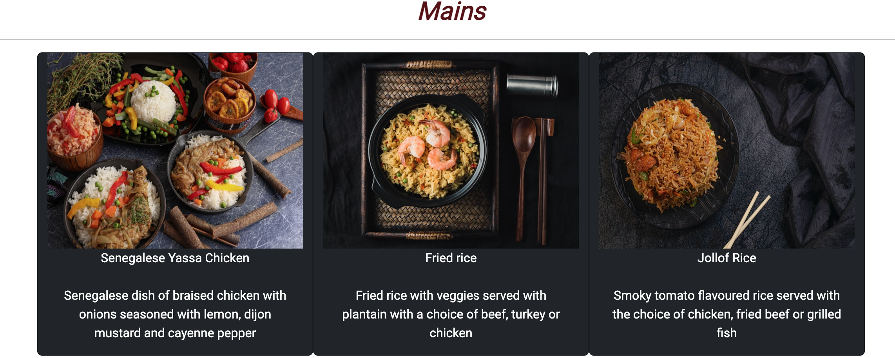

# Testing 

## User stories 

### As a user, I am able to nagivate through the website and view desired content with minimal issues

 - As a user, I am able to navigate through the website and view desired content with minimal issues

 ### As User, I want to be able to obtain key information of the restaurant from the landing page

  - As a user, I am able to obtain key informatiion of the restaurant from the landing page

### As the admin, I am able to login to the admin page so I can access the site's back end

  - 

### As the site admin, I can display the restaurant menu options so that the user knows what is on offer

 - 
 - 
 - 

 ### As a user, I want to be able to fill a booking form in order to make a reservation

  - 

### As a user, I want to be able to register in order to log in and access my bookings 

  - 

### As a user, I want to be able to make amendments to my booking when I need/want to

 - 

 ### As a user, I want to be able to log in and cancel my booking when necessary

  - 

