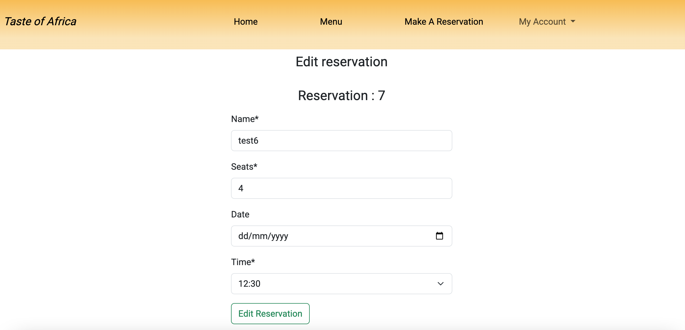
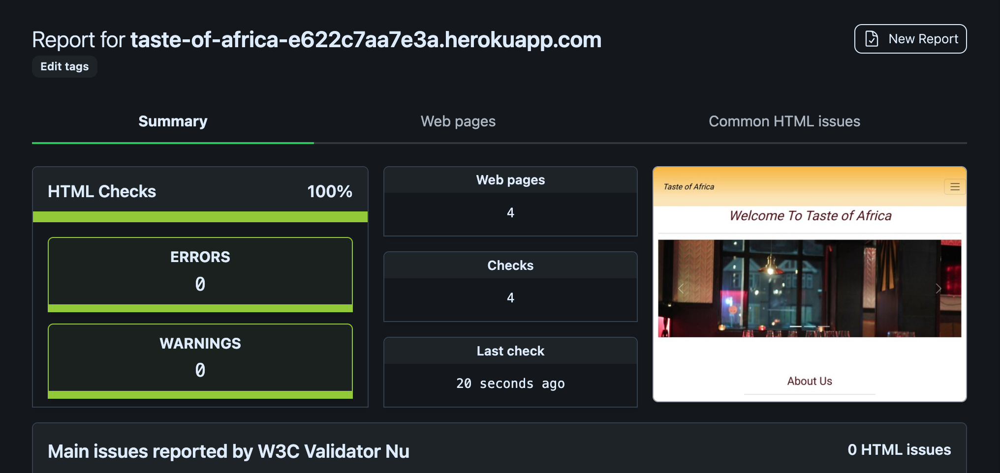

# Testing 

Please click the link ahead to return to readme file [README](README.md)

## User stories 

### As a user, I am able to nagivate through the website and view desired content with minimal issues

 - As a user, I am able to navigate through the website and view desired content with minimal issues

 ### As User, I want to be able to obtain key information of the restaurant from the landing page

  - As a user, I am able to obtain key informatiion of the restaurant from the landing page

### As the admin, I am able to login to the admin page so I can access the site's back end

  -

### As the site admin, I can display the restaurant menu options so that the user knows what is on offer

 - 
 - 
 - 

 ### As a user, I want to be able to fill a booking form in order to make a reservation

  - 

### As a user, I want to be able to register in order to log in and access my bookings 

  - 

### As a user, I want to be able to make amendments to my booking when I need/want to

 - 

 ### As a user, I want to be able to log in and cancel my booking when necessary

  - 

### As a user, I want to be aware of the opening time for when I want to make a reservations 

 - On the footer, you can find the location of the restaurant as well as the opening time
  
  
  - On the reservation page, at the bottom of the form there Is a time drop that allows the user to pick which time suits them best. The first time slot being 12.30pm to the last one being 21:30pm
  

### As a user, I want to be able to log in and see all my reservations

 - 

### As the site owner, I want to be able to access the admin panel and be able to update the menu list

- 
- As a user, I can access the menu admin panel with no issues. Furthermore, there is add menu button on the top right of the page for when there is a change/update on the menu.
- 

# Code Validation 

## HTML 

- While testing my html files, I came across a couple of minor issues that were resolved to the best of my knowledge 

## CSS 

- No issues came up while testing my CSS code

## Pyhton Validator 

- Menu models.py

- Menu views.py 

- Reservation forms.py

- Reservation models.py 

- Reservation views.py 

